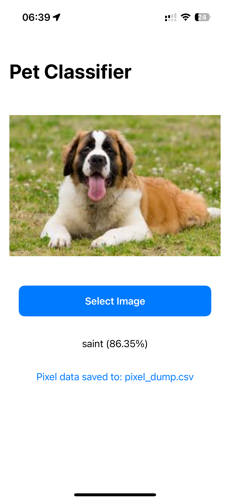
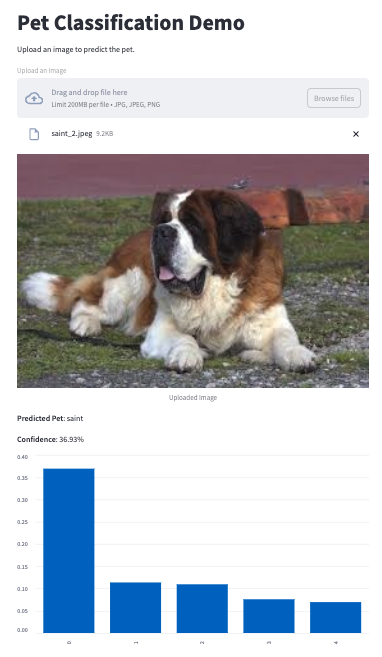

# Pet Detect

The project is designed to identify various pets using the Oxford-IIIT Pet Dataset. I trained a convolutional neural network (CNN) to recognize 37 different breeds of cats and dogs. Then, converted the trained PyTorch model to Apple's Core ML format to use the model in iOS app.

This project demonstrates the end-to-end process of developing a machine learning model, converting it to ML package using coremltools, and creating a SwiftUI pet classifications on iOS.


1. **Data Preparation and Training**: Preprocessed and split the datasets into training, validation, and testing subsets. A CNN is trained on this data to learn distinguishing features of each breed.

2. **Model Conversion**: Once trained, the PyTorch model is converted to Core ML format using coremltools, making it compatible with iOS applications.

3. **iOS Integration**: A SwiftUI-based iOS application is developed, allowing users to select images from their device. The Core ML model processes these images to predict the pet breed, providing users with immediate and accurate classifications.

4. **Web Demonstration**: For those who prefer a web interface, a Streamlit application is available, offering similar functionalities in a browser environment.

5. **Debugging and Visualization**: Debug the model conversion and iOS deployment uging pixel_dump.csv.

## Streamlit Demo Usage 
```
streamlit run app.py
```

## Preview
<div class="image-container" style="display: flex; align-items: flex-start; gap: 20px;">
    
    
</div>
